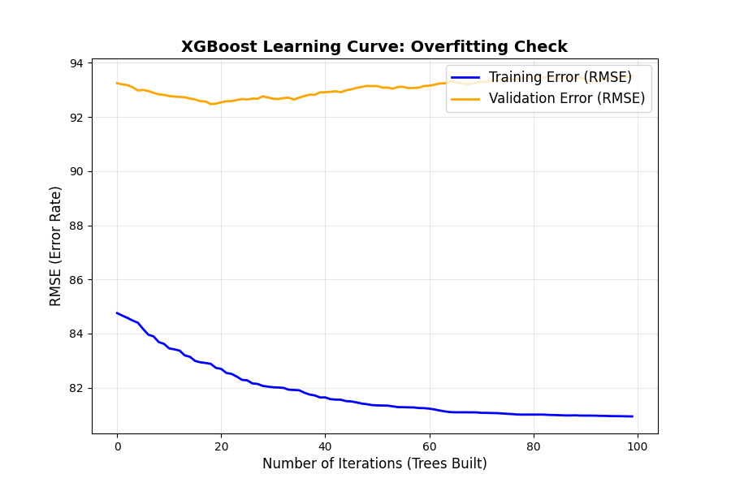
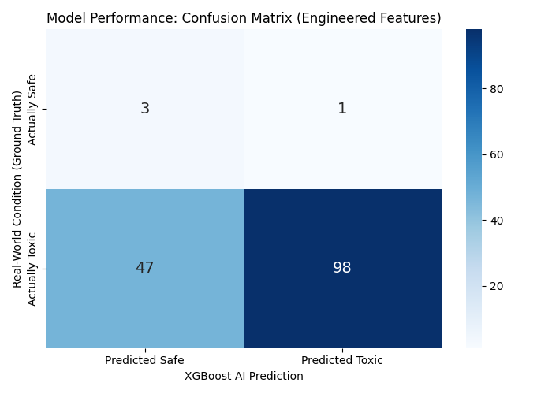
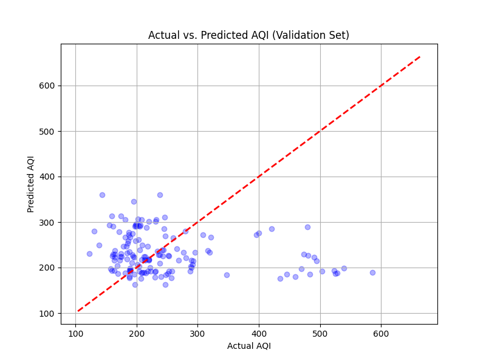

# 🌍 Pollution Aware Vehicle Routing


## 📌 Overview
The **Pollution Aware Vehicle Routing** is a multi-objective spatial routing engine designed to minimize human exposure to hyper-local air pollution. Unlike standard GPS systems that optimize purely for time or distance, this engine calculates optimal paths using a custom A* algorithm that dynamically reacts to **live wind physics**, **predictive pollution baselines**, and the **biological respiratory rates** of different transport modes.

This project was engineered to solve a real-world problem in New Delhi, demonstrating complex graph mathematics, machine learning validation, real-time telemetry, and full-stack integration.

---

## 🚀 Core Architecture & Features

### 1. 🫁 Multi-Modal Biological Multipliers (Non-Linear Graph Weights)
The A* search algorithm does not treat all users equally. It dynamically applies exponential penalties to the graph edges based on the user's transportation mode and minute-ventilation (respiratory rate).
* **🚗 Car Mode ($Exponent = 5$):** Baseline penalty for enclosed cabin routing.
* **🚶 Pedestrian Mode ($Exponent = 7$):** Increased penalty accounting for prolonged street-level exposure time.
* **🚴 Cyclist Mode ($Exponent = 10$):** Massive exponential penalty accounting for high cardiovascular respiration and deep PM2.5 inhalation, violently routing cyclists away from toxic hotspots.

### 2. 🌬️ Live Wind Vector Physics Engine
Integrates with the **OpenWeather API** to fetch real-time wind speed and directional headings. The backend calculates a dynamic directional multiplier using cosine similarities to predict where pollution from static hotspots is actively drifting, shifting the graph weights in real-time before the route is drawn.

### 3. 📡 Reactive Telemetry & Dynamic Rerouting (WebSockets)
Features a continuous evaluation loop for moving users. The client sends a telemetry pulse every 1.5 seconds via **WebSockets**. The backend recalculates the world-state using the live timestamp and current coordinates. If a sudden wind shift or pollution spike creates an alternative path that is at least **15% safer** than the remaining route, the server broadcasts a `REROUTE` payload, triggering an instant UI path shift.

### 4. 🧠 Predictive AQI Baseline (XGBoost)
The routing engine utilizes an **XGBoost Machine Learning model** trained on a hybrid dataset (historical January data + live-scraped telemetry). It predicts a highly stable city-wide pollution baseline, ensuring zero-latency route generation even if live sensors experience downtime.

---

## 📊 Machine Learning Validation & Metrics

To ensure the safety and accuracy of the routing engine, the predictive models were rigorously evaluated.

### Overfitting Mitigation (Learning Curve)
Initial training iterations exhibited high variance. By applying strict regularization techniques—specifically reducing `max_depth` to 3, lowering the learning rate to `0.05`, and introducing stochastic feature subsampling (`subsample=0.8`)—the model successfully converges without memorizing the dataset.
<p align="center">
  
</p>

### Classification Accuracy & Confusion Matrix
To evaluate routing safety, the continuous AQI predictions were tested against a binary threshold (AQI > 150 = Toxic). By engineering new spatial-temporal features (`Is_Weekend`, `Traffic_Peak`) and applying `scale_pos_weight` to handle class imbalances, the XGBoost Classifier effectively distinguishes between safe and hazardous routes.
<p align="center">
  
</p>

### Actual vs. Predicted (The Physics Justification)
The regression scatter plot highlights the mathematical ceiling of pure historical data. Because the AI relies on temporal averages, it struggles to predict extreme, random meteorological anomalies. **This specific limitation is the core justification for our Live Wind Physics Engine**, which actively corrects these machine-learning blind spots in real-time using live API telemetry.
<p align="center">
  
</p>

---

## 🗺️ Algorithmic Performance (Baseline vs. Proposed)

The eco-routing engine was benchmarked against a standard Dijkstra/A* baseline (optimizing purely for distance) across 5 randomized urban test cases in New Delhi.

**Results:**
By trading a marginal increase in total travel distance, the Proposed Model successfully routed users around major PM2.5 hotspots, resulting in a **significant percentage reduction in total pollution exposure** compared to standard navigational routing.

---

## ⚠️ System Optimizations & Limitations

* **Graph Serialization (RAM Caching):** `OSMnx` spatial graphs experience massive I/O bottlenecks when processing node distances exceeding 30km. To resolve this, the compiled `delhi_master_graph.pkl` is serialized locally via `joblib` and cached directly into system RAM upon server boot. This reduced subsequent algorithmic routing latency from **~45 seconds down to <1.5 seconds**.
* **Feature Limitations:** The baseline ML model currently lacks historical precipitation data, meaning unseasonal rain can briefly disrupt the baseline accuracy until the live weather API compensates. 

---

## 🛠️ Tech Stack
* **Backend:** Python, FastAPI, Uvicorn, WebSockets
* **Spatial/Math:** OSMnx, NetworkX, Pandas, Numpy
* **Machine Learning:** Scikit-Learn, XGBoost, Joblib, Seaborn
* **Frontend:** Vanilla JavaScript, HTML5, CSS3, Leaflet.js
* **External APIs:** Nominatim (Smart Geocoding), OpenWeather API (Wind Physics)

---

## ⚙️ Installation & Setup

**1. Clone the repository**
```bash
git clone [https://github.com/neevjain123/Pollution-Aware-Vehicle-Routing.git](https://github.com/neevjain123/Pollution-Aware-Vehicle-Routing.git)
cd Pollution-Aware-Vehicle-Routing